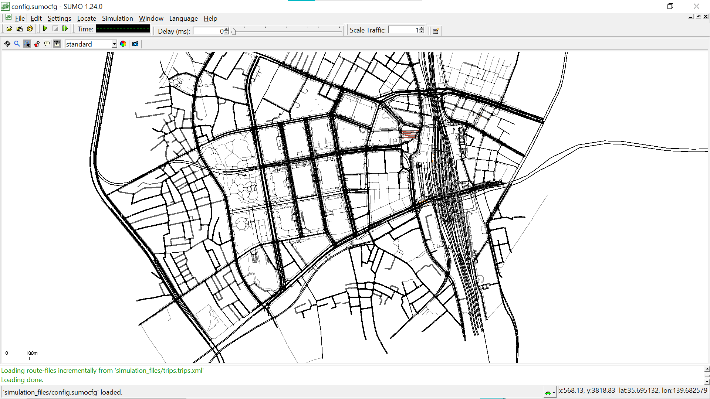

# Project HERO - Phase 1: Simulation Environment

**Status:** `Completed`  
**Date:** September 19, 2025


---
## Phase 1 Overview

This branch contains the completed work for the foundational phase of Project HERO. The primary goal was to construct a high-fidelity, controllable urban simulation environment. This serves as the "digital twin" of a city where our AI agents will eventually operate.

## ✅ Key Accomplishments

* **Built a Realistic Road Network:** Successfully processed real-world map data from **OpenStreetMap** for Shinjuku, Japan, and converted it into a traffic-routable network using the **SUMO `netconvert`** tool.

* **Established a Controllable Simulation:** Created a complete simulation instance that can be launched, viewed, and managed. Generated random traffic to validate the network's integrity.

* **Developed a Python Control Interface:** Established a bridge between Python and the SUMO simulation using the **Traci library**. This allows for programmatic control of the simulation, which is essential for the future AI implementation.

* **Professional Git Workflow:** Set up the project repository on GitHub and utilized a **feature-branching workflow** (`phase-1-simulation-environment`) to manage development.

---
## 🛠️ Technologies Used in This Phase

* **Simulation Engine:** SUMO (Simulation of Urban MObility)
* **Geospatial Data:** OpenStreetMap
* **Core Language:** Python
* **Simulation Bridge:** Traci
* **Version Control:** Git & GitHub

## 🚀 How to Run the Phase 1 Demo

1.  **Prerequisites:** Ensure you have **Python** and **SUMO** installed.
2.  **Clone the Repository:**
    ```bash
    git clone [https://github.com/MIBHA/Project-HERO.git](https://github.com/MIBHA/Project-HERO.git)
    cd Project-HERO
    ```
3.  **Switch to the Phase 1 Branch:**
    ```bash
    git checkout phase-1-simulation-environment
    ```
4.  **Launch the Simulation:**
    ```bash
    sumo-gui -c simulation_files/config.sumocfg
    ```
    This will open the SUMO GUI, and you can press the "Play" button to see the random traffic simulation of Shinjuku. 

## 📂 Key Files Created

* `simulation_files/map.osm`: The raw map data downloaded from OpenStreetMap.
* `simulation_files/map.net.xml`: The converted, usable SUMO road network.
* `simulation_files/trips.trips.xml`: The file containing the randomly generated test traffic.
* `simulation_files/config.sumocfg`: The main configuration file that brings the network and traffic together.

